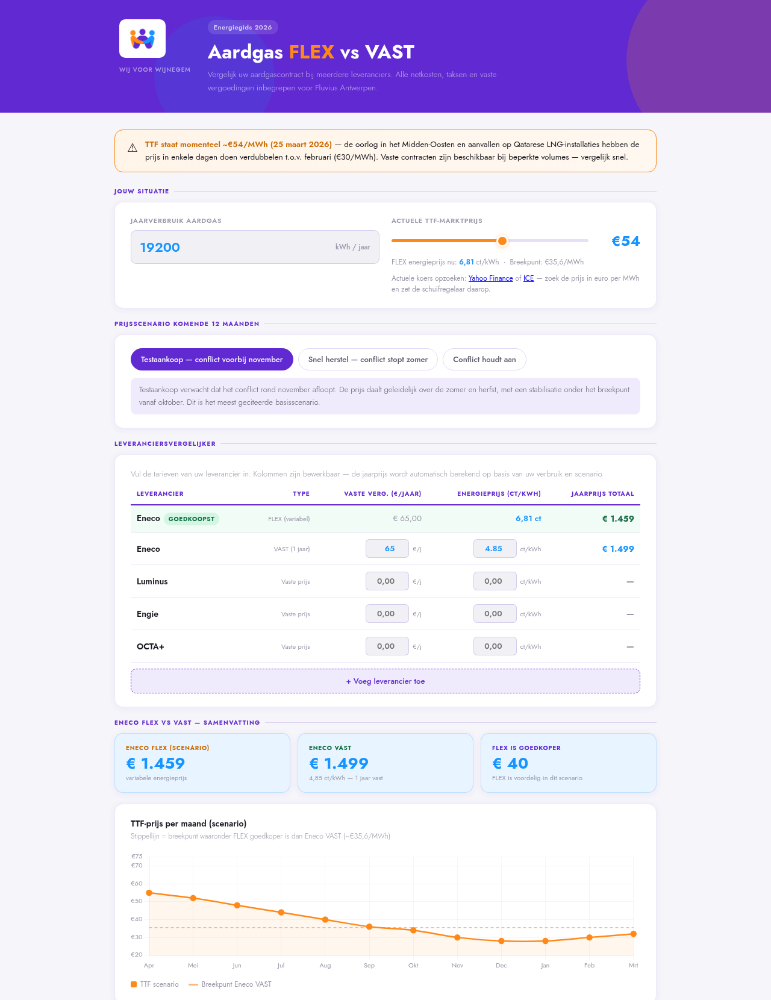

# gasvergelijker

## ▶ [Open the tool](https://forsskieken.github.io/gasvergelijker/)

Nothing to install, nothing to download — the link opens it in your browser, on a
phone as well. **Rechtstreeks naar de rekentool: [klik hier](https://forsskieken.github.io/gasvergelijker/).**

Compares a Belgian natural gas contract — variable (FLEX) against fixed — over
the coming twelve months, with all network fees, taxes and standing charges
included.

## Use

1. Enter your **yearly consumption** in kWh (it is on your annual bill).
2. Drag the **TTF slider** to today's market price in €/MWh. The page links to
   [Yahoo Finance](https://finance.yahoo.com/quote/TTF%3DF/) and to the
   [ICE](https://www.theice.com/products/27996665/Dutch-TTF-Gas-Futures) exchange.
3. Pick a **price scenario** for the coming year — the three tabs.
4. Type each supplier's standing charge and energy price into the table. The
   yearly total updates as you type; the cheapest row is marked.

## Keep your own copy

Right-click the link above and save, or download `index.html` from this page. The
file works from your disk with no internet, except that the charts and the font
come from a CDN.

## What it computes

| Part | Detail |
|---|---|
| FLEX energy price | `(0.1 × monthly TTF + 1.021) × 1.06`, in ct/kWh incl. 6 % VAT |
| Break-even | The TTF price below which FLEX beats the fixed contract |
| Network fees | Fluvius Antwerpen T2 (> 5 000 kWh/year), standing plus per-kWh |
| Transport | Fluxys, per kWh |
| Excise | 0.9782 ct/kWh up to 12 000 kWh, 1.0681 ct/kWh above |
| Monthly profile | Yearly consumption spread over a typical Belgian heating curve |

## Read this before you trust a number

- **The rates are a snapshot of March 2026** and the scenarios were written
  around the market of that moment. Check every figure against the current rate
  card before you decide anything.
- Only one supplier's rates are filled in; the rest stay zero until you type them.
- The TTF you look up online is the day price, while the formula uses the monthly
  average. Good enough for an estimate, not exact.
- Estimates, not an offer. No financial advice.
- Nothing leaves your browser: no upload, no server, nothing stored.
- The interface and the rates are Belgian, and so is the language.
